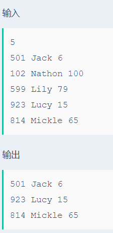

# 最小年龄员工

## 题目描述
>职工有职工号，姓名，年龄.输入n个职工的信息，找出3个年龄最小的职工打印出来。

## 输入描述:
>输入第一行包括1个整数N，1<=N<=30，代表输入数据的个数。
>接下来的N行有N个职工的信息：
>包括职工号(整数)， 姓名(字符串，长度不超过10)， 年龄(1<=age<=100)。

## 输出描述:
>可能有多组测试数据，对于每组数据，
>输出结果行数为N和3的较小值，分别为年龄最小的职工的信息。
>关键字顺序：年龄>工号>姓名，从小到大。

## 示例：
>
