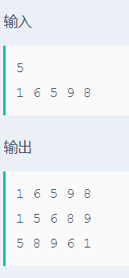

# 二叉排序树遍历

## 题目描述
>输入一系列整数，建立二叉排序树，并进行前序，中序，后序遍历。

## 输入描述:
>输入第一行包括一个整数n(1<=n<=100)。
>接下来的一行包括n个整数。

## 输出描述:
>可能有多组测试数据，对于每组数据，将题目所给数据建立一个二叉排序树，并对二叉排序树进行前序、中序和后序遍历。每种遍历结果输出一行。每行最后一个数据之后有一个空格。
>
>输入中可能有重复元素，但是输出的二叉树遍历序列中重复元素不用输出。

## 示例：
>
