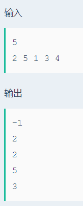

# 二叉排序树

## 题目描述
>二叉排序树，也称为二叉查找树。可以是一颗空树，也可以是一颗具有如下特性的非空二叉树：
>1. 若左子树非空，则左子树上所有节点关键字值均不大于根节点的关键字值；
>2. 若右子树非空，则右子树上所有节点关键字值均不小于根节点的关键字值； 
>3. 左、右子树本身也是一颗二叉排序树。 
>现在给你N个关键字值各不相同的节点，要求你按顺序插入一个初始为空树的二叉排序树中，每次插入后成功后，求相应的父亲节点的关键字值，如果没有父亲节点，则输出-1。

## 输入描述:
>输入包含多组测试数据，每组测试数据两行。
>第一行，一个数字N（N<=100），表示待插入的节点数。
>第二行，N个互不相同的正整数，表示要顺序插入节点的关键字值，这些值不超过10^8。

## 输出描述:
>输出共N行，每次插入节点后，该节点对应的父亲节点的关键字值。

## 示例：
>
