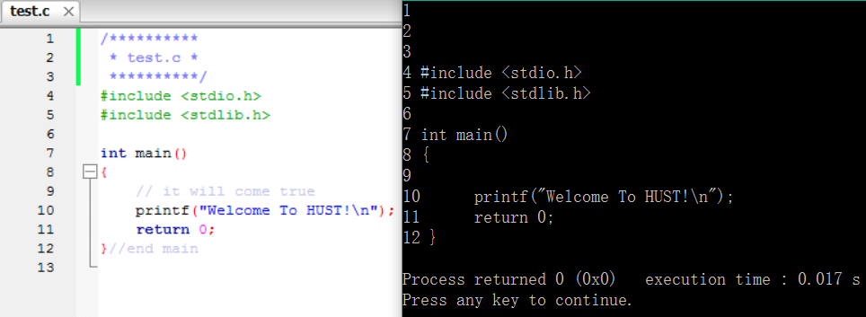

# 打印代码

## 题目描述
>根据题目要求打印在本题文件目录下test文件夹中的test.c文件

## 输入描述:
>test文件夹中的test.c文件

## 输出描述:
>(1)给每行代码前加上格式为“# ”的序号，其中“#”为行号。    
>(2)不打印代码中“//”及其之后的注释文本。    
>(3)不打印代码中“/\*......\*/”及其之间的注释文本。    
>(4)若存在无打印内容的空行，仍需要打印该行的行号。

## 示例：
>
