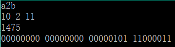

# 十二进制系统

## 题目描述
>十二进制数是数学中一种以12为底数的记数系统，它由0~9、a、b组成。与十进制的对应关系是：0~9对应0~9，a对应10，b对应11。例如，十二进制数a2，十进制为122。按要求完成本题。    

## 输入描述:
>输入一个仅含十二进制数字的字符串（字母一律小写，总长度不超过8个字符）。    

## 输出描述:
>(1)输出该十二进制数每一位对应的十进制数（从高位到低位顺序输出，空格隔开）。    
>(2)实现“十二进制”转换“十进制”算法，输出该十二进制数对应的十进制数。    
>(3)输出转换后的十进制数在内存中的每个二进制位（共4字节，字节之间空格隔开）。    

## 示例：
>
