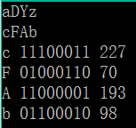

# 加密输出

## 题目描述
>根据题目要求加密字符串，进行奇偶校验以二进制表示，并且输出奇偶校验后的数值以十进制表示   
## 输入描述:
>输入一个长度小于80的字符串   

## 输出描述:
>(1)对于原字符串进行加密：对字母字符输出其ASCII码值右移2的字符，对于字母y z加密后输出a b（加密后不改变字母大小写）。    
>(2)奇偶校验：对加密后的字符串判断每个ASCII码值（二进制）中1的个数，若不是奇数个1则在最高位取1，否则取0。   
>(3)输出第二问奇偶校验后的数值以十进制表示。    

## 示例：
>
