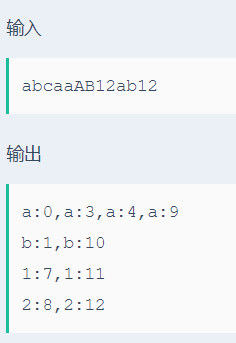

# 找位置

## 题目描述
>对给定的一个字符串，找出有重复的字符，并给出其位置，如：abcaaAB12ab12 输出：a，1；a，4；a，5；a，10，b，2；b，11，1，8；1，12， 2，9；2，13。

## 输入描述:
>输入包括一个由字母和数字组成的字符串，其长度不超过100。

## 输出描述:
>可能有多组测试数据，对于每组数据，
>按照样例输出的格式将字符出现的位置标出。
>1、下标从0开始。
>2、相同的字母在一行表示出其出现过的位置。

## 示例：
>
