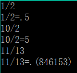

# 分数转换

## 题目描述
>编写程序按要求将分数转换为小数输出。    

## 输入描述:
>以N/D形式输入3个分数，其中N（0<=N<=65535）为分子，D（0<=N<=65535）为分母。    

## 输出描述:
>输出分数对应的小数形式，若小数形式存在循环节，则用括号括起来，    
>例如1/3=0.333......则本题输出为.(3)。    

## 示例：
>
