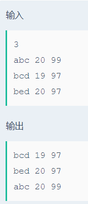

# 成绩排序

## 题目描述
>有N个学生的数据，将学生数据按成绩从高到低排序，如果成绩相同则按姓名字符的字典序排序，如果姓名的字典序也相同则按照学生的年龄从小到大排序，并输出N个学生排序后的信息。

## 输入描述:
>测试数据有多组，每组输入第一行有一个整数N（N<=1000），接下来的N行包括N个学生的数据。
>每个学生的数据包括姓名（长度不超过100的字符串）、年龄（整形数）、成绩（小于等于100的正数）。

## 输出描述:
>将学生信息按成绩进行排序，成绩相同的则按姓名的字母序进行排序。
>然后输出学生信息，按照如下格式：
>姓名 年龄 成绩
>
>学生姓名的字母序区分字母的大小写，如A要比a的字母序靠前(因为A的ASC码比a的ASC码要小)。

## 示例：
>
