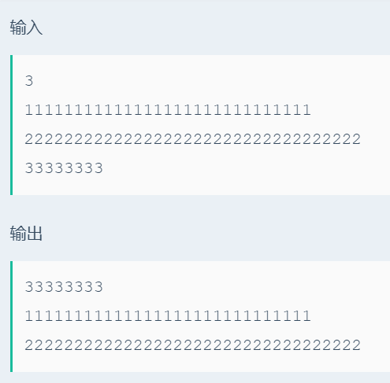

# 大整数排序

## 题目描述
>对N个长度最长可达到1000的数进行排序。

## 输入描述:
>输入第一行为一个整数N，(1<=N<=100)。
>接下来的N行每行有一个数，数的长度范围为1<=len<=1000。
>每个数都是一个正数，并且保证不包含前缀零。

## 输出描述:
>可能有多组测试数据，对于每组数据，将给出的N个数从小到大进行排序，输出排序后的结果，每个数占一行。

## 示例：
>
