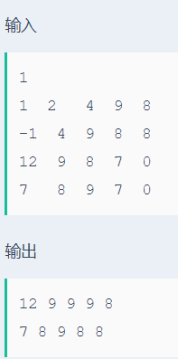

# 最大两个数

## 题目描述
>输入一个四行五列的矩阵，找出每列最大的两个数。

## 输入描述:
>接下来的四行每行包括五个整数。代表一个四行五列的矩阵，矩阵元素全部是整数。

## 输出描述:
>可能有多组测试数据，对于每组数据，按照样例输出的格式将每列最大的两个数输出，如果最大的两个数中的一个数在这一列中有多个相同的值，则行值取行值小的那一个。
>输出时要保留原矩阵的行列顺序，即在原矩阵中行值小的，在输出矩阵中的行值依然小。

## 示例：
>
