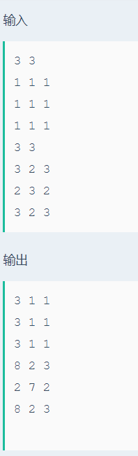

# 矩阵最大值

## 题目描述
>编写一个程序输入一个mXn的矩阵存储并输出，并且求出每行的最大值和每行的总和。 要求把每行总和放入每行最大值的位置，如果有多个最大值，取下标值最小的那一个作为最大值。 最后将结果矩阵输出。

## 输入描述:
>输入的第一行包括两个整数m和n(1<=m,n<=100)，分别代表矩阵的行和列的维数。
>接下来的m行每行有n个数，代表矩阵的元素。

## 输出描述:
>可能有多组测试数据，对于每组数据，输出按题目要求执行后的矩阵。

## 示例：
>
