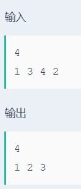

# 特殊排序

## 题目描述
>输入一系列整数，将其中最大的数挑出(如果有多个，则挑出一个即可)，并将剩下的数进行排序，如果无剩余的数，则输出-1。

## 输入描述:
>输入第一行包括1个整数N，1<=N<=1000，代表输入数据的个数。
>接下来的一行有N个整数。

## 输出描述:
>可能有多组测试数据，对于每组数据，第一行输出一个整数，代表N个整数中的最大值，并将此值从数组中去除，将剩下的数进行排序。
>第二行将排序的结果输出。

## 示例：
>
