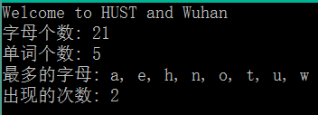

# 句子统计

## 题目描述
>从键盘输入一行英文句子，其中只有英文单词和空格，每个单词之间由若干个空格隔开，英文单词有区分大小写，分别统计句中字母、单词、出现最多字母、出现次数等信息并输出。    

## 输入描述:
>输入一行英文句子，其中只有英文单词和空格，每个单词之间由若干个空格隔开，英文单词有区分大小写。

## 输出描述:
>(1)统计输出句中英文字母个数。    
>(2)统计输出句中单词的个数。    
>(3)查找句子中出现次数最多的字母（不区分大小写）和次数，若不止一个则都需要找到，并输出这些字母及次数。    

## 示例：
>
