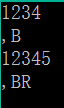

# 字符串压缩

## 题目描述
>按照题目要求将一串数字以ASCII码形式加密压缩，并输出加密压缩后的字符串。     

## 输入描述:
>以字符串形式接收输入的一串数字。    

## 输出描述:
>输出时把每两位对应的数字+32，并保存为对应的ASCII码字符保存，比如输入为12，输出时将12+32=44的ASCII码字符保存到新的字符串，如果输出数字的个数为奇数，则在数字串末尾补0。    

## 示例：
>
