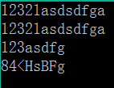

# 字符处理

## 题目描述
>按照题目要求对输入字符串进行处理。    

## 输入描述:
>无冗余地输入一个字符串。    

## 输出描述:
>(1)输出无冗余输入的原始字符串。    
>(2)在(1)的基础上，对于不是首次出现的字符进行过滤，例如abcba，过滤后为abc，并输出过滤后的字符串。    
>(3)在(2)的基础上，对于字符0~9，A~F，a~f，将其对应的ASCII码的低4位进行对调，例如将1011转换为1101，并将对应的ASCII码所对应的字符输出，若输出的字符为英文字母转换为大写，并输出处理后的字符串。    

## 示例：
>
