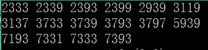

# 超级素数

## 题目描述
>编写程序找出所有4位超级素数，每行输出6个数，两两之间用空格隔开。    
>超级素数：一个n位超级素数是指一个n位正整数，它的前1位、前2位、...、前n位均为素数，例如2333是个4位超级素数，因为2、23、233、2333均为素数。         

## 输入描述:
>本题无须输入。      

## 输出描述:
>输出所有4位超级素数，每行输出6个，两两之间用空格隔开。      

## 示例：
>
