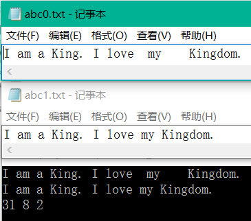

# TXT文件操作

## 题目描述
>编写一个程序完成以下任务:
>(1)从键盘输入一段文本（ASCII编码）并将其输出到D盘根目录下的abc0.txt文件中，再关闭该文件。输入以Ctrl+Z结束。
>(2)打开D盘根目录下的abc0.txt文件，将单词之间2个以上的空格都压缩为1个空格，输出处理后的文本，并将处理后的文本输出到D盘根目录下的abc1.txt文件中并关闭该文件。
>(3)打开D盘根目录下的abc1.txt文件，统计文件中字符的个数，单词的个数（单词之间以空格或“.”隔开），以及句子的个数（以“.”隔开），并输出统计结果。

## 输入描述:
>输入包括1行字符串，以Ctrl+Z结束，字符串中包含多个单词和句子，单词之间以一个或多个空格隔开，句子之间以“.”隔开。

## 输出描述:
>完成题目要求的文件操作同时，输出压缩后的文本以及相关统计量。

## 示例：
>
